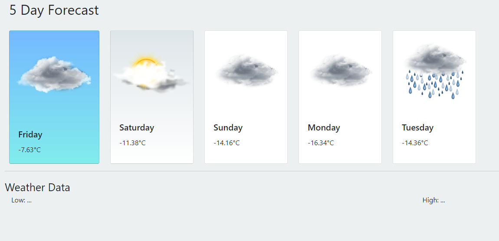

# clime.io
Weather application to practice using Boostrap, JS, JQuery, and JSON with APIs. This was my first solo project while learning web development. I'm proud of it regardless of how elementary this is. 

# What will this project do?

- Get user's city

- Present 5 day forecast for the user

- Switch between celsius and fahrenheit

- Offer a nice user interface and user experience 
  (was inspired by card interfaces much like the early builds of Google Fuschia although the result is significantly lesser)
  

# Known issues
Some weather don't have a corresponding icon which breaks the bootstrap card elements. 
